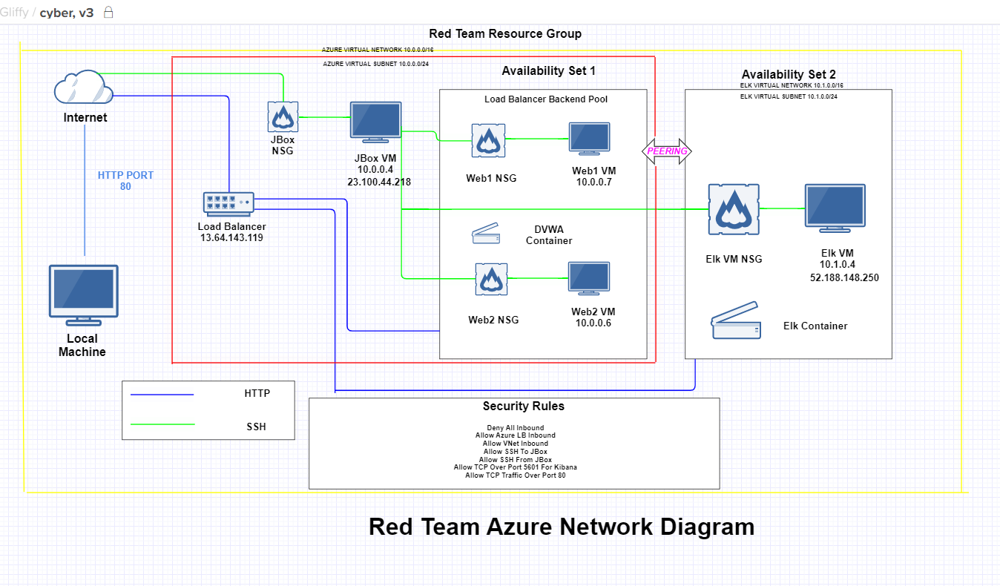
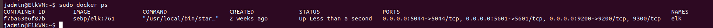
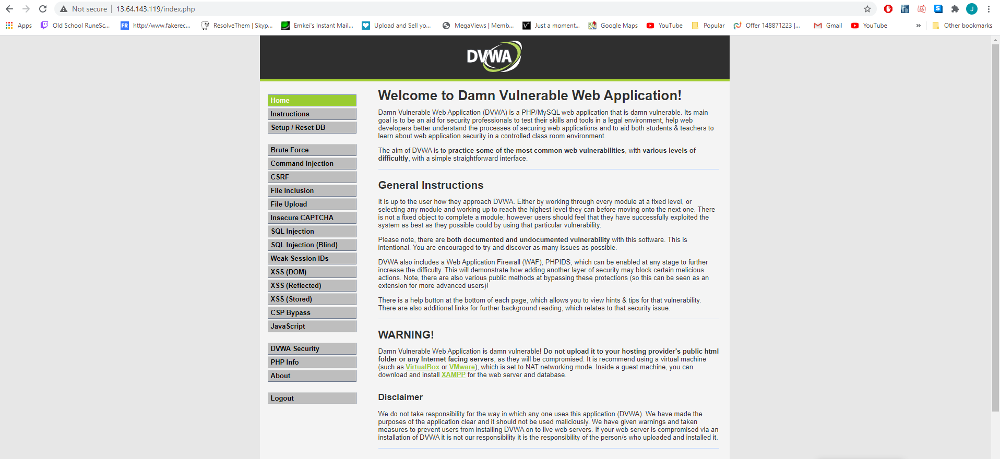
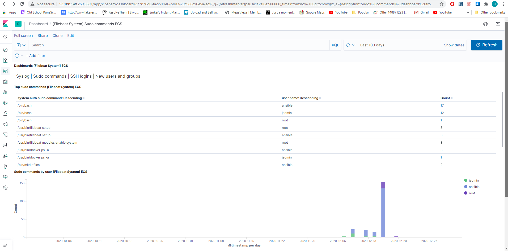

## Automated ELK Stack Deployment

The files in this repository were used to configure the network depicted below.

These files have been tested and used to generate a live ELK deployment on Azure. They can be used to either recreate the entire deployment pictured above. Alternatively, select portions of the ansible playbook file may be used to install only certain pieces of it, such as Filebeat.

  - All playbook files can be found in the "Ansible" folder in this repo: https://github.com/johnpaternostro/AzureNetwork/blob/main/Ansible/

This document contains the following details:
- Description of the Topology
- Access Policies
- ELK Configuration
  - Beats in Use
  - Machines Being Monitored
- How to Use the Ansible Build

### Description of the Topology

The main purpose of this network is to expose a load-balanced and monitored instance of DVWA, the D*mn Vulnerable Web Application.

Load balancing ensures that the application will be highly accessible, in addition to restricting attackers to the network.
Load balancing protects against DDoS attacks. The benefit of a jump box is to improve a companies network security by having a secure monitored device that monitors all traffic/logs & to ensure incoming connections to sensitive machines are safe. 

Integrating an ELK server allows users to easily monitor the vulnerable VMs for changes to the files and system metrics/logs.
Filebeat monitors log files to collect and parse log events in a neat format with statistics to be shown on logstash or elasticsearch.
Metricbeat records metrics from the operating system and server.

The configuration details of each machine may be found below.
| Name | Function | IP Address | Operating System |
|------|----------|------------|------------------|
| JBox | Gateway  | 10.0.0.4   | Linux            |
| Web1 | VM       | 10.0.0.7   | Linux            |
| Web2 | VM       | 10.0.0.6   | Linux            |

### Access Policies

The machines on the internal network are not exposed to the public Internet. 

Only the JBox machine can accept connections from the Internet. Access to this machine is only allowed from the following IP addresses:
My Public IP (Masked for security)

Machines within the network can only be accessed by JBox 10.0.0.4

A summary of the access policies in place can be found in the table below.

| Name          | Publicly Accessible             | Allowed IP Addresses |
|---------------|---------------------------------|----------------------|
| JBox          | No                              | My Public IP         |
| Elk Server    | Yes (Port 5601 ONLY for Kibana) | Internet             |
| Load Balancer | Yes (DVWA)                      | Internet             |

### Elk Configuration

Ansible was used to automate configuration of the ELK machine. No configuration was performed manually, which is advantageous because it helps eliminate variabilities between configurations on multiple machines and improves efficiency.

The playbook implements the following tasks:
- Installs Docker
- Installs Python-pip
- Install Docker python module
- Increases virtual memory
- Downloads and launches a docker ELK container with the following published ports: 5601 9200 5044

The following screenshot displays the result of running `docker ps` after successfully configuring the ELK instance.

### Target Machines & Beats
This ELK server is configured to monitor the following machines:
- Web1 10.0.0.6
- Web2 10.0.0.7
- JBox 10.0.0.4

We have installed the following Beats on these machines:
- MetricBeat
- FileBeat

These Beats allow us to collect the following information from each machine:
- MetricBeat is useful for collecting system metrics, an example of its use would be: collecting windows log events, sudo events, system file changes.
- FileBeat is useful for collecting log data. It can go accross tons of different log files and remove/format data and look for specific events.

### Using the Playbook
In order to use the playbook, you will need to have an Ansible control node already configured. Assuming you have such a control node provisioned: 

SSH into the control node and follow the steps below:
- Copy the install-elk.yml file to /etc/ansible/files
- Update the hosts file to include elk server IP 10.1.0.4
- Run the playbook, and navigate to http://52.188.148.250:5601/app/kibana to check that the installation worked as expected.

/etc/ansible/elk-playbook.yml gets copied to the directory

- _Which file do you update to make Ansible run the playbook on a specific machine? How do I specify which machine to install the ELK server on versus which to install Filebeat on?_
The hosts file must be updated and the specified machine IP must be added under "webservers"

- _Which URL do you navigate to in order to check that the ELK server is running?
http://52.188.148.250:5601/app/kibana

### Example Images

